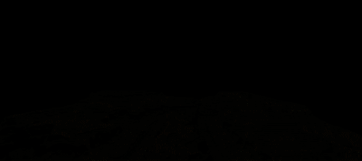

# A-Frame Component: Three-Geo (Updated Version)


### **Description / Rationale**
This is an updated version of A-Frame component for "Three-geo", <a href="https://github.com/w3reality/three-geo">the library for 3D geographic visualization</a>.  The original version of the component was developed by <a href="https://github.com/w3reality/three-geo/issues/1">KJStrand</a>. The updated version is compativle with latest version of A-frame and has the following new features:
* The component and three-geo files were combined into single file;
* Flat map style was added;
* Possibility of selecting the style of the map: elevated, wireframe and contour
* Possibility of assigning color to wireframe styled map.   

### **Instructions**
In order to use the component attach "three-geo" to any entity. The component has the following attributes: 
* <b>token: { type: 'string', default: '*******' }</b> - Token generated by Mapbox.
* <b>lat: { type: 'number', default: 35.3778 }</b> - latitude of the location on Mapbox.
* <b>lng: { type: 'number', default: 138.7472 }</b> - longitude of the location on Mapbox.
* <b>radius: { type: 'number', default: 5.0 }</b> - radius of bounding circle (km).
* <b>zoom: { type: 'number', default: 10 }</b> - zoom level.
* <b>axesHelper: { type: 'boolean', default: false }</b> - Axes helper to learn about orientation in 3d space.
* <b>flatMap: { type: 'boolean', default: false }</b> - Flat map style without any elevations.
* <b>mapStyle: { type: 'string', default: "elevated" }</b> - The following map styles are present: elevated, wireframe and contour. Will show if flatMap is false. 
* <b>wireframeColor: { type: 'color', default: "#ffffff" }</b> - if wireframe map style is selected, allows to change the color of the wireframe. 

The code below shows the sample implementation of the component:
```
<!DOCTYPE html>
<html lang="en">
<head>
    <meta charset="UTF-8">
    <meta name="viewport" content="width=device-width, initial-scale=1.0">
    <title>A-Frame Component: Three-geo (Updated)</title>
    <script src="https://aframe.io/releases/1.4.2/aframe.min.js"></script>
    <script src="js/three-geo-component.js">
    </script>
</head>
<body>
    <a-scene>
        <a-entity id="first" three-geo="token: your-mapbox-token-here;
                   lat: 36.2058;
                   lng:  -112.4413;
                   radius: 5;
                   zoom: 13;
                   axesHelper: false;
                   flatMap: false;
                   mapStyle: elevated;
                   wireframeColor: #ffffff;
                   " rotation="-90 180 0" position="0 0.7 -1.5" scale="2 2 2"></a-entity>
                   <a-sky color="#000000"></a-sky>
    </a-scene>
</body>
</html>
```
To learn more about "Three-geo" library, check the repository page of it.

### **Tech Stack**
The project is powered by AFrame and Three.js.

### **Demo**
See demo of the component here: [Demo](https://three-geo.glitch.me/)
